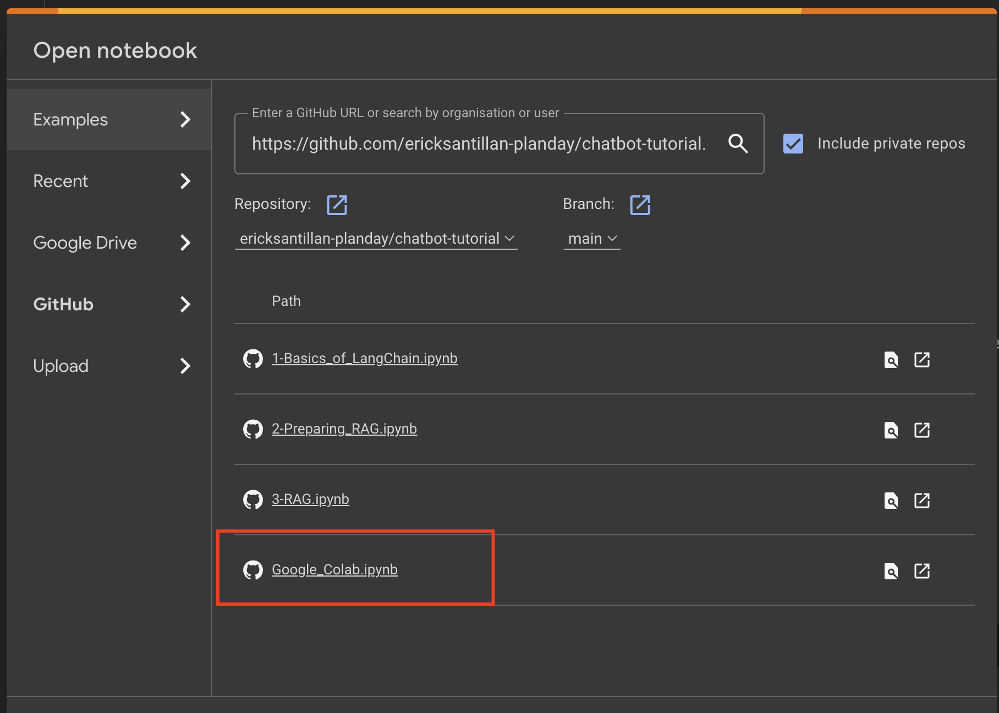

# Chatbot tutorial
This repository contains some jupyter-notebooks to serve as a tutorial on how to create a RAG agent with LangChain.

# Pre-requesits

Please run these steps **before** the workshop. There are two ways to be ready for the workshop
1. Google Colab: Requires the least amount of set-up but requires a google account
2. Local: You can run all of this locally, but you would need to install a couple of things first

## Google Colab (strongly recommended)
Please sign-up with you Google account and go to: https://colab.research.google.com/ 

If prompted click on "Authorize with Github" from settings and refresh

You can select GitHub and put this repository URL: https://github.com/ericksantillan-planday/chatbot-tutorial.git
You should look somethig like this:



On the page select Google_Colab.ipynb

Run the first two cells to be sure that you are ready for the workshop! And that's it :)

## Locally
You can of course run this locally, but you may encounter different issues depending of your OS, if you already have a python installation, your environment etc..


You have to make sure that you have:
* Python installed
* Git installed
* Jupyter-lab or Jupyter-notebooks installed

### Install Python
For python you can use `Self-service`: Search for python and click installed.
Once it's been installed open a terminal and run the following to make sure you have python
```shell
python3 --version
```
For more info please see: https://www.python.org/downloads/


Now, clone the repository:
```shell
git clone https://github.com/ericksantillan-planday/chatbot-tutorial.git
cd chatbot-tutorial
```

### Install jupyter lab
You can follow the steps [here](https://jupyter.org/install)
It mainly consists on running:
```shell
pip3 install jupyterlab
```
However, we found the more consistent way in mac is to use `brew`:
```shell
brew install jupyterlab
```

You may need to run
```shell
jupyter-lab build
```


### Create virtual environment

Open a new terminal (this should refresh your PATH) and run:
```shell
# Create virtual environment
python3 -m venv venv
# Activate it
source venv/bin/activate
# Install requirements
pip3 install -r requirements.txt
# Install python interactive kernel for this environment
pip3 install ipykernel
# Make kernel available to jupyer (you may need sudo to run this, depending on your jupyter installation)
python3 -m ipykernel install --name chatbot-tutorial
```

### Run Jupyter-lab
On a new terminal run
```shell
jupyter-lab
```
If prompted select the chatbot-tutorial kernel and that should be it :)


If something is not running feel free to ping us!